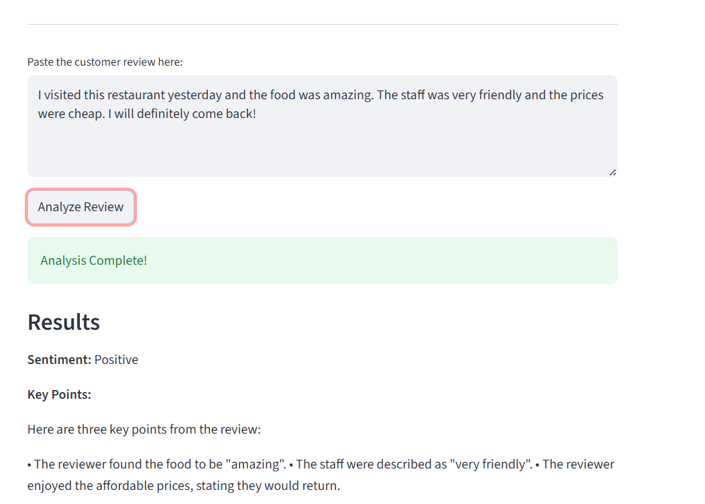
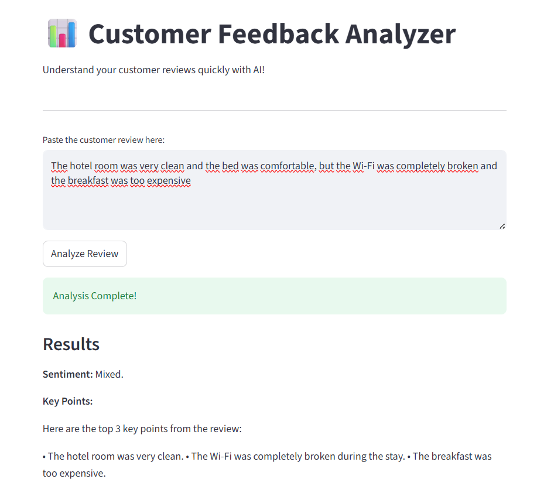

# NLP Project Technical Report: Customer Feedback Analyzer

## 1. Problem Description
Many businesses receive hundreds of customer reviews every day. It takes too much time for a human to read all of them. The objective of this project is to build a local AI application that can read a customer review, understand the sentiment, and extract the most important points automatically.

## 2. System Design and Workflow
The system uses a multi-step pipeline:
* **User Interface:** A web application where the user pastes the text.
* **Preprocessing:** The system checks if the text is long enough (at least 15 characters).
* **Step 1 (Sentiment):** The application sends a prompt to the LLM to classify the text as Positive, Negative, Neutral, or Mixed. 
* **Step 2 (Key Points):** A second prompt asks the LLM to extract the top 3 key points from the review.
* **Postprocessing:** The results are formatted nicely on the screen.

## 3. Model Selection and Justification
I chose to use **Ollama** running locally on my machine. 
* **Model:** Llama 3.2.
* **Configuration:** I set the model's **temperature to 0**.
* **Justification:** I selected this model because it is small and fast. It runs very well on a personal computer without needing an expensive cloud server. I changed the temperature to 0 because sentiment analysis needs precise and logical answers, not creative ones. This makes the AI more reliable for this specific task.

## 4. Implementation Details
* **Language:** Python
* **GUI Framework:** Streamlit (it is easy to use and makes clean interfaces).
* **LLM Integration:** The official `ollama` Python library.

## 5. Discussion of Results and Iterative Development
**Results:** The application works very well. It successfully extracts information from reviews.
**Iterative Development:** During testing, the model classified a review with good and bad points as "Negative". I improved the system using Prompt Engineering. I added the word "Mixed" to the instructions and told the AI exactly when to use it. After this change, the model worked perfectly. 
**Limitations:** The system might be slow on older computers because the model runs locally.

## 6. Screenshots

